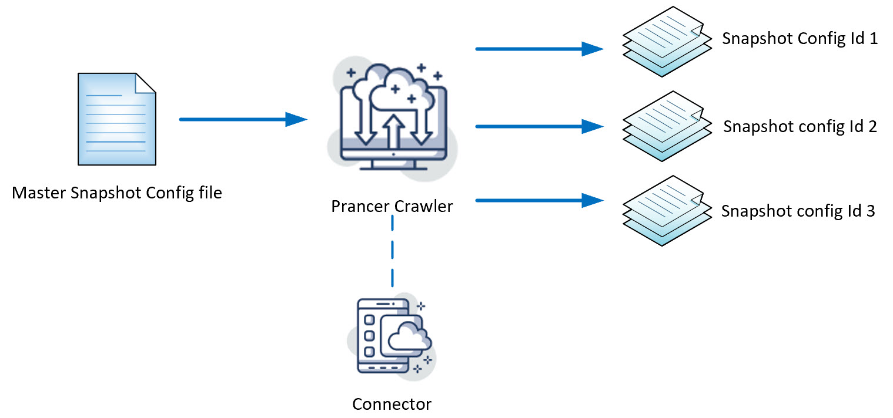

> Target Platform : Enterprise Edition, Premium Edition
## What is crawler?
**Crawler** is a processor in the prancer validation framework to discover new resources in a target environment. The user can provide a master snapshot configuration file to the crawler processor and based on the type of resources defined in the master snapshot configuration file, the crawler will generate the snapshot configuration files, which are individual resources in the target environment.
> To learn more about the snapshot, review [this section](../snapshots/snapshot-definition.md).

## Definitions
- **Crawler**: a processor in the prancer cloud validation framework to examine a target environment and find new resources.
- **Master Snapshot Configuration File**: a json based configuration file in the prancer cloud validation framework which defines the type of resources in a target environment
- **Snapshot Configuration File**: a json based configuration file in the prancer cloud validation framework which defines individual resources in a target environment
- **Master test file**: a json based test file in the prancer cloud validation framework which defines test cases for different type of resources
- **test file**: a json based test file in the prancer cloud validation framework which defines test cases for individual resources

## workflow 
### How the crawler works
Prancer validation framework runtime is scoped to a specific container. If you want to run the crawler, you should call the executable and scope it to a specific container. That container should have at least one master snapshot configuration file for the crawler to start working.
- the crawler function is being called
- Crawler connects to the provider by using the connector file defined in the master snapshot configuration file
- Crawler generates snapshot configuration files based on the resource types defined in the master snapshot configuration file

### Running prancer validation framework based on the crawler output
Prancer validation framework runtime is scoped to a specific container. After successfully running the crawler process, the target container should have at least these items:
- Master snapshot configuration file(s)
- Snapshot configuration file(s)
- Master test file(s)

And then, running the validation framework:
- Call the prancer validation framework to run and scope it to a container
- Validation processor gets the first snapshot id from the snapshot configuration file, load the corresponding master test file, send to the appropriate functions to test and then go to the next snapshot id
- After all snapshot Ids completed in the snapshot configuration file, generate the output

## Supported providers
These providers are currently supported to use the crawler feature.:
- Azure
- Filesystem

The development of other providers are in progress.

## How to use it
### CLI
To run the crawler process from the CLI, use the following command:
prancer crawler <name-of-the-container>
as an example:
prancer crawler container3

### API
To run the crawler by API call, use the following format:

`curl -U <username>:<password> https://prancertests.info/whitekite/api/crawler/  -d'{"container": "crawlertes"}'`

The curl request shall cause -u operatin to be sent as `{"Authorization":"Bearer <base64(<username>:<password>)>"}`

> To learn more about the API call, review this page.

## Use the crawler processor to update monitored resources
User could run the crawler multiple times. The resources in the target environment could change overtime and this results in a different output from the crawler processor every time.
In order to manage the environment change in the snapshot configuration file, we have an attribute in the snapshot configuration file nodes called `status`
The first time the crawler do the crawling, it sets the `"status":"active"`

> Note: In the process of taking the snapshots, just the nodes with the “status”:active will be processed

The next time we run the crawler:

- Find a resource

- Check the resource in the snapshot configuration file:

    - If the node exists: do not change the `status`

    - If the node does not exist: add the node with the `"status": "active"`

- After running the process, for all the nodes that we could not find them during the crawl process we set the `"status":"inactive"`

