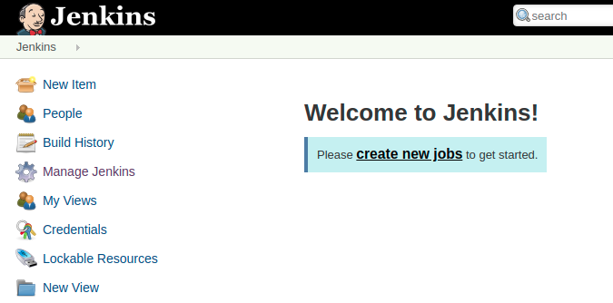
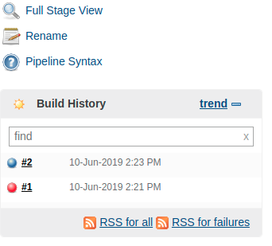

This tutorial will show you all the steps required to setup a basic **Jenkins** CI server that could leverage **Prancer** as a step. This tutorial doesn't show how to use **Prancer** but more how to use it in a CI/CD setup such as **Jenkins**.

Before taking this tutorial, you will need to follow some more generic steps:

1. First, let's [install Docker](https://docs.docker.com/install/) to avoid installing **Jenkins** directly on our system

Then, you can follow these steps:

1. Checkout example files
2. Setup a **Jenkins** server
3. Create a **Prancer** project where our files will exist
4. Create a **Jenkins** job
5. Run the job
6. Trigger a failure
7. Cleanup and rejoice

# Checkout example files

We have all the files already prepared for you in a public read-only repository. 

We'll still show all the content of each files in this tutorial and explain some tweaks you can and should do. You can use your own repository and write the files yourself but it'll be easier and faster if you checkout ours:

    cd <working directory>
    git clone https://github.com/prancer-io/prancer-jenkins-tutorial
    cd prancer-jenkins-tutorial

# Setup a **Jenkins** server

## Get the Jenkins container running

To get our integration running, we need a **Jenkins** server. Let's start one using **Docker**:

    docker network create prancer
    docker run --rm --name prancer-jenkins-tutorial -p 8080:8080 -p 50000:50000 --network prancer jenkins/jenkins:lts

Once the server has started, look at the log for the administrator password. It should look something like:

    *************************************************************
    *************************************************************
    *************************************************************

    Jenkins initial setup is required. An admin user has been created and a password generated.
    Please use the following password to proceed to installation:

    e6013bfc6f034d2d8b47c7b56d129955

    This may also be found at: /var/jenkins_home/secrets/initialAdminPassword

    *************************************************************
    *************************************************************
    *************************************************************

Copy this string in memory, you will need it in a few seconds.

Once **Jenkins** is ready (you should see a `Jenkins is fully up and running` in the log), visit the [server](http://localhost:8080). It will ask you to unlock your **Jenkins** server. Paste in the code you copied from the log. Then, following the instructions below:

1. Click on `Install suggested plugins`
2. Create a user with username and password both set to `admin`
3. Set the proper URL if not properly set
4. Confirm the start of **Jenkins**

## Get a MongoDB container running

The next step is to create a **MongoDB** server to store your results. We'll add that to the previously created **Docker** network. Create a new terminal window and run:

    docker run --rm -it --name prancer-mongodb-server --network prancer mongo

Thats it, you now have a dockerized **MongoDB** server.

## Configure the master / slave node with Prancer

The final step to setting up your instance is to install **Prancer** on the master node (The **Jenkins** server). We named our node `prancer-jenkins-tutorial`, therefore, using the `--name` switch, we can execute simple root commands to install **Prancer** on that container:

    # Update your container's apt cache and install prancer
	docker exec -itu 0 prancer-jenkins-tutorial apt update -y
    docker exec -itu 0 prancer-jenkins-tutorial apt install -y python3 python3-pip
    docker exec -itu 0 prancer-jenkins-tutorial pip3 install prancer-basic
    docker exec -itu 0 prancer-jenkins-tutorial pip3 install --upgrade pyasn1-modules

At this point, your master node should be setup properly to run **Prancer**!

# Create a Prancer project

Next, we'll need a **Prancer** project. This is where all the configuration and test files will live. Here's the content of each file with a brief description.

## data/config.json

This file contains the data that we want to test using **Prancer**.

    {
        "webserver": {
            "port": 80
        }
    }

## data/config-fails.json

This file contains the data that we want to test using **Prancer**. This file is used in the failure scenario!

    {
        "webserver": {
            "port": 443
        }
    }

## tests/prancer/project/.gitignore

This is a simple .gitignore file that ensures we are not commiting files we don't want in our project. Prancer will output many files such as logs and reports, you want to have such a file.

    log/*
    *.log
    output-*json

## tests/prancer/project/config.ini

This is the configuration file. You can change many things in here but the default configuration we provide should suffice. If you want to use your own **MongoDB** server then you should change the `dburl` property.

    [LOGGING]
    level = DEBUG
    propagate = true
    logFolder = log
    dbname = whitekite

    [MONGODB]
    dburl = mongodb://prancer-mongodb-server/validator
    dbname = validator

    [REPORTING]
    reportOutputFolder = validation

    [TESTS]
    containerFolder = validation
    database = false

## tests/prancer/project/gitConnector.json

This is the configuration file that leads to the files **Prancer** will need to check out when running tests. It is currently pointing to our public read-only repository. If you want to use your own, feel free to remap the remote once you checked out our files and push the files somewhere else.

    {
        "fileType": "structure",
        "companyName": "prancer-test",
        "gitProvider": "https://github.com/prancer-io/prancer-jenkins-tutorial.git",
        "branchName":"master",
        "private": false
    }

## tests/prancer/project/validation/git/snapshot.json

This file describes the information we want to test, you shouldn't need to change anything here.

    {
        "fileType": "snapshot",
        "snapshots": [
            {
                "source": "gitConnector",
                "type": "git",
                "testUser": "git",
                "nodes": [
                    {
                        "snapshotId": "1",
                        "type": "json",
                        "collection": "security_groups",
                        "path": "data/config.json"
                    }
                ]
            }
        ]
    }

## tests/prancer/project/validation/git/test.json

This file describes the tests we want to achieve on the information we took a snapshot of.

    {
        "fileType": "test",
        "snapshot": "snapshot",
        "testSet": [
            {
                "testName ": "Ensure configuration uses port 80",
                "version": "0.1",
                "cases": [
                    {
                        "testId": "1",
                        "rule": "{1}.webserver.port=80"
                    }
                ]
            }
        ]
    }

## tests/prancer/project/validation/git-fails/snapshot.json

This file describes the information we want to test, you shouldn't need to change anything here. This file is used in the failure scenario!

    {
        "fileType": "snapshot",
        "snapshots": [
            {
                "source": "gitConnector",
                "type": "git",
                "testUser": "git",
                "nodes": [
                    {
                        "snapshotId": "1",
                        "type": "json",
                        "collection": "security_groups",
                        "path": "data/config-fails.json"
                    }
                ]
            }
        ]
    }

## tests/prancer/project/validation/git-fails/test.json

This file describes the tests we want to achieve on the information we took a snapshot of. This file is used in the failure scenario!

    {
        "fileType": "test",
        "snapshot": "snapshot",
        "testSet": [
            {
                "testName ": "Ensure configuration uses port 80",
                "version": "0.1",
                "cases": [
                    {
                        "testId": "1",
                        "rule": "{1}.webserver.port=80"
                    }
                ]
            }
        ]
    }

# Create a **Jenkins** job

Back to **Jenkins**, you can now create your first job. A job is what runs a certain set of operations. In our case, we'll make it very simple and only run **Prancer** on some checked out code but in a more complex scenario, you'd have many other steps to run before hand. 

Let's create a job:

1. Visit the [Jenkins server](http://localhost:8080)
2. Login if necessary
3. Click on "Create new jobs"

    

4. Name your job something like "prancer-jenkins-tutorial" and select the "Pipeline" type and click "Ok"
5. Skip down to the last section and paste the following pipeline script into the pipeline box:

    

**Pipeline script**

    pipeline { 
        agent any 
        options {
            skipStagesAfterUnstable()
        }
        stages {
            stage('Build') { 
                steps { 
                    git url: 'https://github.com/prancer-io/prancer-jenkins-tutorial.git',
                        branch: 'master'
                }
            }
            stage('Test'){
                steps {
                    dir("tests/prancer/project") {
                        sh "prancer git"
                    }
                }
            }
        }
    }

Remember to update the git url with the url to your repository! Once done, save the job and you should be back to the job dashboard!

# Run the job

Now let's run the job to ensure the test works:

1. Go to the job's page (Something like [http://localhost:8080/job/prancer-jenkins-tutorial/](http://localhost:8080/job/prancer-jenkins-tutorial/))
2. Clicking on the "Build now" button on the side bar

    

This will trigger a build and within seconds, thanks to our very simple project, you should have a passing build. Let's check the logs!

1. Click on the date beside the last build you ran in the build history

    

2. Click on "Console Output"

    

3. Look at the log

It should show the same log as if you ran **Prancer** from your machine but instead it was run as a CI job on your **Jenkins** server.

    2019-09-01 16:08:02,760(interpreter: 209) - ###########################################################################
    2019-09-01 16:08:02,760(interpreter: 210) - Actual Rule: {1}.webserver.port=80
    2019-09-01 16:08:02,778(interpreter: 219) - **************************************************
    2019-09-01 16:08:02,779(interpreter: 220) - All the parsed tokens: ['{1}.webserver.port', '=', '80']
    2019-09-01 16:08:02,779(rule_interpreter:  35) - {'snapshots': {'1': 'security_groups'}, 'dbname': 'validator'}
    2019-09-01 16:08:02,779(rule_interpreter:  36) - <class 'dict'>
    2019-09-01 16:08:02,780(rule_interpreter:  78) - Regex match- groups:('1', '.webserver.port'), regex:\{(\d+)\}(\..*)*, value: {1}.webserver.port, function: <bound method RuleInterpreter.match_attribute_array of <processor.comparison.comparisonantlr.rule_interpreter.RuleInterpreter object at 0x7f2e9dde3748>> 
    2019-09-01 16:08:02,780(rule_interpreter: 121) - matched grps: ('1', '.webserver.port'), type(grp0): <class 'str'>
    2019-09-01 16:08:02,782(rule_interpreter: 150) - Number of Snapshot Documents: 1
    2019-09-01 16:08:02,782(rule_interpreter:  78) - Regex match- groups:('80', None), regex:(\d+)(\.\d+)?, value: 80, function: <bound method RuleInterpreter.match_number of <processor.comparison.comparisonantlr.rule_interpreter.RuleInterpreter object at 0x7f2e9dde3748>> 
    2019-09-01 16:08:02,783(rule_interpreter: 169) - LHS: 80, OP: =, RHS: 80
    2019-09-01 16:08:02,783(rundata_utils:  92) - END: Completed the run and cleaning up.

You can see here, in the last rule interpreted, that the LHS is **80** so the comparison between **80** and **80** passes and so the test succeeds.

# Trigger a failure

Now that we have a working example, let's simulate a failure by changing the test that is ran with another that cannot succeed:

1. Go to the job's page (Something like [http://localhost:8080/job/prancer-jenkins-tutorial/](http://localhost:8080/job/prancer-jenkins-tutorial/))
2. Click on the `Configure` option in the sidebar

    

3. Go down to the pipeline script and change it to:

**Pipeline script**

    pipeline { 
        agent any 
        options {
            skipStagesAfterUnstable()
        }
        stages {
            stage('Build') { 
                steps { 
                    git url: 'https://github.com/prancer-io/prancer-jenkins-tutorial.git',
                        branch: 'master'
                }
            }
            stage('Test'){
                steps {
                    dir("tests/prancer/project") {
                        sh "prancer git-fails"
                    }
                }
            }
        }
    }

Now let's run the job to ensure the test fails:

1. Go to the job's page (Something like [http://localhost:8080/job/prancer-jenkins-tutorial/](http://localhost:8080/job/prancer-jenkins-tutorial/))
2. Clicking on the "Build now" button on the side bar

    

This will trigger a build and within seconds, thanks to our very simple project, you should have a passing build. Let's check the logs!

1. Click on the date beside the last build you ran in the build history

    

2. Click on "Console Output"

    

3. Look at the log

It should show the same log as if you ran **Prancer** from your machine but instead it was run as a CI job on your **Jenkins** server.

    2019-09-01 16:10:10,723(interpreter: 209) - ###########################################################################
    2019-09-01 16:10:10,723(interpreter: 210) - Actual Rule: {1}.webserver.port=80
    2019-09-01 16:10:10,737(interpreter: 219) - **************************************************
    2019-09-01 16:10:10,737(interpreter: 220) - All the parsed tokens: ['{1}.webserver.port', '=', '80']
    2019-09-01 16:10:10,737(rule_interpreter:  35) - {'snapshots': {'1': 'security_groups'}, 'dbname': 'validator'}
    2019-09-01 16:10:10,737(rule_interpreter:  36) - <class 'dict'>
    2019-09-01 16:10:10,738(rule_interpreter:  78) - Regex match- groups:('1', '.webserver.port'), regex:\{(\d+)\}(\..*)*, value: {1}.webserver.port, function: <bound method RuleInterpreter.match_attribute_array of <processor.comparison.comparisonantlr.rule_interpreter.RuleInterpreter object at 0x7f02463805c0>> 
    2019-09-01 16:10:10,738(rule_interpreter: 121) - matched grps: ('1', '.webserver.port'), type(grp0): <class 'str'>
    2019-09-01 16:10:10,739(rule_interpreter: 150) - Number of Snapshot Documents: 1
    2019-09-01 16:10:10,740(rule_interpreter:  78) - Regex match- groups:('80', None), regex:(\d+)(\.\d+)?, value: 80, function: <bound method RuleInterpreter.match_number of <processor.comparison.comparisonantlr.rule_interpreter.RuleInterpreter object at 0x7f02463805c0>> 
    2019-09-01 16:10:10,740(rule_interpreter: 169) - LHS: 443, OP: =, RHS: 80
    2019-09-01 16:10:10,741(rundata_utils:  92) - END: Completed the run and cleaning up.

You can see here that the LHS is 443 and it is compared to 80 so the test fails.

# Cleanup and rejoice

Here is a list of things to cleanup if you followed the tutorial without any changes:

1. In the terminal windows that runs the **Jenkins** server, press `CTRL+C` to shut it down and destroy the container
2. In the terminal windows that runs the **MongoDB** server, press `CTRL+C` to shut it down and destroy the container
3. Destroy the network: `docker network rm prancer`

# Conclusion

That's it, you are done. You now know how to setup a basic `Prancer` test in **Jenkins**.

Thank you for completing this tutorial on **Prancer**.

We hope to see you in the next tutorial!